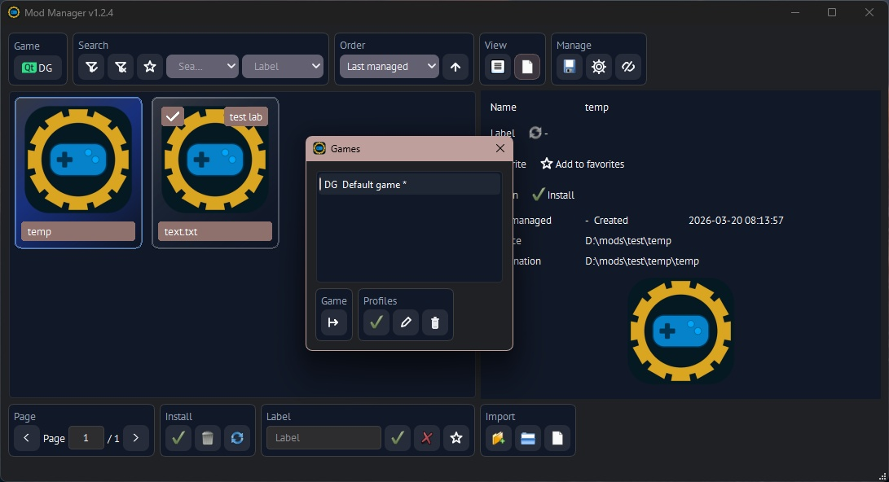

# Mod Manager

A symlink-based mod manager for Unreal Engine games. Manages mods as symbolic links (files) and junctions (folders) in the game directory — no file copying. Games that cannot load linked files can switch a profile to physical copying instead.

---



---

<details>
<summary>Run, Build, Test details</summary>


## Quick Start

```bash
# Optional: enable tab-completion in CLI
pip install -r requirements.txt

# Launch interactive text UI
python mod-manager.py

# Launch GUI
python mod-manager.py gui
```

> **Windows note:** Directory junctions do not require elevation. For file symlinks, Administrator rights may be needed if the account lacks the *Create symbolic links* privilege — this can be avoided by enabling [Developer Mode](https://learn.microsoft.com/en-us/windows/apps/get-started/enable-your-device-for-development).

---

## Build GUI Executable

<details>
<summary>Onedir app (recommended — faster startup)</summary>

```powershell
python build-gui-exe.py --exe --onedir
# Output: dist\mod-manager-gui\mod-manager-gui.exe
```

The build script checks for required GUI/build packages and, in an interactive shell, asks whether missing packages should be installed.

</details>

<details>
<summary>Onefile app (single executable, slower startup)</summary>

```powershell
python build-gui-exe.py --exe --onefile
# Output: dist\mod-manager-gui.exe
```

</details>

<details>
<summary>Portable Python archive (no PyInstaller)</summary>

```bash
python build-gui-exe.py --pyz
# Output: dist\mod-manager-gui.pyz
```

</details>

Environment variables are still supported for compatibility:

```powershell
$env:MOD_MANAGER_BUILD_EXE="1"
$env:MOD_MANAGER_ONEFILE="1"
python build-gui-exe.py
```

The `assets/icon.ico` file is used as the executable icon and the `assets/` folder is bundled with `--exe` builds so the GUI window also shows it. Regenerate the icon with `python tools/generate_icon.py` (requires Pillow).

---


## Tests

Run the full test suite with:

```bash
python tests/run_tests.py --jobs auto
```

The parallel runner discovers every individual test case in `tests/test_*.py` and runs them across available workers. Use `--jobs 1` for a serial run. The tests cover CLI request parsing and dispatch, the `python mod-manager.py` launcher modes, and core GUI flows with filesystem, dialogs, and link operations patched out.

Each test gets its own process with a timeout (`--timeout`, 60 seconds by default). A test that exceeds it is killed and reported as a failure instead of blocking the run, so a stray modal dialog or an unfinished background worker can never hang the suite. `tests/qt_support.py` also turns an unexpected modal dialog into an immediate failure and disposes each window properly, which keeps the GUI tests fast.

The standard unittest command is still supported:

```bash
python -m unittest discover -s tests -p "test_*.py"
```

`tests/test_architecture.py` is an architecture guard: it fails if a module outside `mod_manager/ui/` imports PySide6, if the token modules stop being Qt-free, or if a colour literal appears outside `mod_manager/ui/theme/colors.py`.
</details>

---

<details>
<summary>Project Structure</summary>

```
app_paths.py                    App identity, paths, DEFAULT_CONFIG
mod_manager/
  cli.py  menus.py              Command line and console menus
  mods.py  presets.py  links.py Mod discovery, presets, link management
  storage.py  workers.py        JSON storage, background workers
  dragdrop.py  image.py         Windows COM drag/drop, image scaling
  settings_schema.py            Setting labels, tooltips, ranges, validation (Qt-free)
  ui/
    __init__.py                 Startup: config -> UI scale -> Qt -> window
    gui shell (gui.py)          Main window
    context.py  task_runner.py  Shared app state and background actions
    icons.py                    Standard and painted icons
    theme/
      colors.py                 Every colour, light and dark (Qt-free)
      tokens.py                 Every size, padding, radius, column spec (Qt-free)
      stylesheet.py             Stylesheet generated from colours and tokens
      accent.py  manager.py     OS accent detection and theme application
    widgets/                    Reusable components: buttons, toolbar sections,
                                forms, pager, detail panel, drop target
    models/                     Table models, tile delegate, column setup
    pages/toolbar_specs.py      Declarative action button groups
    dialogs/                    Dialog shells and modal prompts
    controllers/                Widget registry and action wiring
tests/                          unittest suite plus the architecture guard
```

Action buttons are never placed in a flat row. Each group is declared in `mod_manager/ui/pages/toolbar_specs.py` as `(section key, caption, actions)` and rendered by `IconToolbar` as a captioned bordered section.
</details>

<details>
<summary>Features</summary>

---

- Install / uninstall mods via symlinks — no file duplication
- Per game profile install method: links, or physical file copies for games that reject linked files
- Overwrite confirmation before a copy install replaces files already in the game folder
- Group several file types into one mod, for example `.pak` + `.utoc` + `.ucas` sharing a name; the detail panel lists every file of the group
- Game profiles with separate game folders, source folders, presets, labels, and active default selection
- Presets — save and restore named mod sets
- Labels — tag and filter mods by category
- Profile-scoped favorites — star mods independently from labels and combine the favorite, label, and search filters
- Pagination, search, and ordering
- Broken link detection and cleanup
- GUI (PySide6/Qt) and CLI interfaces
- Drag, drop, paste, or pick mod files/folders in the GUI
- Optional local image for mods
- List and tile view modes in the GUI
- Tile view preview images, installed markers, keyboard navigation, and zoom
- Virtual rendering keeps off-screen mod rows and tiles from being drawn beyond a one-row buffer

---

</details>

<details>
<summary>Extra details</summary>

---

<details>
<summary>Requirements</summary>

- Python 3.10+
- [PySide6](https://pypi.org/project/PySide6/) >= 6.7 — Qt 6 bindings for the GUI (LGPL v3)
- [prompt_toolkit](https://pypi.org/project/prompt_toolkit/) — for interactive CLI tab-completion
- [PyInstaller](https://pypi.org/project/pyinstaller/) — only needed to build a standalone executable

Install all at once:

```bash
pip install -r requirements.txt
```

> **Note:** PySide6 is distributed under the LGPL v3 license. When distributing a built executable, the Qt dynamic libraries must remain replaceable in accordance with the LGPL terms.
</details>

---

<details>
<summary>Data Files</summary>


- `config.json` stores application settings and game profile definitions.
- `profiles/<profile-id>-presets.json` stores named mod sets for each game profile.
- `profiles/<profile-id>-labels.json` stores labels plus last-managed metadata for each game profile.
- `labels.json` also stores the reserved `__favorites__` map, keyed by game profile ID; existing flat label records remain supported.
- Existing global `presets.json` and label records remain supported when no game profile exists.
- `<mods_source_dir>/images` stores optional mod image and is not treated as a mod folder.
</details>

---

<details>
<summary>CLI, Extra details</summary>

## CLI Reference

All commands follow the pattern: `python mod-manager.py <command> <subcommand> [args] [flags]`

### `games` — Manage game profiles

| Subcommand | Description |
|---|---|
| `list` | List game profiles and mark the active default |
| `add <name>` | Add a profile and make it active |
| `select <profile-id>` | Select the active profile for the next launch |
| `edit <profile-id>` | Update profile name or game-specific settings |
| `delete <profile-id>` | Delete a profile |

**Profile options:**

```
--game-mods-dir <path>
--mods-source-dir <path>
--mod-extensions <exts>                       Comma-separated, e.g. .pak,.rar,.utoc
--mod-group-extensions <exts>                 Comma-separated, e.g. .pak,.utoc,.ucas
--mod-recursive-scan / --no-mod-recursive-scan  Scan subfolders of the source directory
--link-prefix <text>
--install-mode link|copy                      How mods reach the game folder
```

These flags are generated from `mod_manager/settings_schema.py`, so `games add --help` prints the same
description that the GUI shows as a tooltip on the matching Game profile field.

`--mod-extensions` accepts any number of comma-separated extensions (e.g. `.pak,.utoc,.ucas`). Add the special `folders` token (e.g. `.pak,folders`) to also treat subfolders of the source directory as mod units. If `--mod-extensions` is empty (the default), every file and folder is shown — this matches the previous behavior. If `--mod-extensions` is set without `folders`, subfolders are no longer treated as mods unless `folders` is included.

`--mod-recursive-scan` makes the manager search subfolders for matching files at any depth (folders that themselves qualify as mod units, per `folders` above, are not recursed into). Files found in subfolders are linked into the game folder by their own filename.

`--mod-group-extensions` joins several file types into a single mod. With `.pak,.utoc,.ucas`, the files `Weapon.pak`, `Weapon.utoc` and `Weapon.ucas` become one mod listed as `Weapon.pak` — named after the first extension in the list that is actually present — and installing, uninstalling, or applying a preset covers every member at once. A grouped mod counts as installed only when all of its files are in the game folder; a half-installed group completes on the next install. Grouped extensions are always treated as mod files even when `--mod-extensions` does not list them, and files are only grouped with siblings in the same folder, so a recursive scan never merges two same-named mods from different subfolders.

`--install-mode` selects how mods reach the game folder. `link` (the default) creates symlinks and junctions as before. `copy` physically copies the mod files, for games that refuse to load linked content; uninstalling then deletes those copies from the game folder and never touches your source mods. In copy mode an install that would replace an existing file asks for confirmation first — the GUI shows a dialog listing the affected files, and the CLI prints them and stops unless `--overwrite` is given.

**Examples:**

```bash
python mod-manager.py games add "Stalker 2" --mods-source-dir "D:/Mods/Stalker2" --game-mods-dir "C:/Games/Stalker2/Content/Paks/~mods"
python mod-manager.py games list
python mod-manager.py games select <profile-id>
```

---

### `mods` — Manage mods

| Subcommand | Description |
|---|---|
| `list` | List mods on current page |
| `search <text>` | Filter by name |
| `label <text>` | Filter by label |
| `page <n>` | Go to page `n` |
| `order <mode>` | Sort order field and direction |
| `install` | Install all mods on page |
| `uninstall` | Uninstall all mods on page |
| `toggle <indexes>` | Toggle mods by index (comma-separated) |
| `label-add <label> <indexes>` | Assign label to selected mods |
| `label-remove <label> <indexes>` | Remove label from selected mods |
| `favorite-add <indexes>` | Add visible mods to favorites by index |
| `favorite-remove <indexes>` | Remove visible mods from favorites by index |

**Common flags** (for `list`, `install`, `uninstall`, `toggle`):

```
--page <n>       Page number (default: 1)
--label <text>   Filter by label
--search <text>  Filter by name
--order <mode>   Sort order
--favorite       Show favorite mods only
--overwrite      Replace existing files (copy install mode only; `install` and `toggle`)
```

Order modes: `default`, `created_date`, `last_managed`, `label`, `name`, `installed`.
Prefix any mode with `-` for descending order, for example `--order -last_managed`.
Legacy `d` and `cd` aliases still work.

**Examples:**

```bash
python mod-manager.py mods list --page 2 --search weapon
python mod-manager.py mods list --order -last_managed
python mod-manager.py mods toggle 1,3,5
python mod-manager.py mods label-add combat 2,4 --page 1
python mod-manager.py mods install --label combat
python mod-manager.py mods list --label combat --favorite
python mod-manager.py mods favorite-add 1,3 --filter-label combat
```

In the GUI, the favorite filter is the star button beside the Label filter. A filled star marks an existing favorite; an outline star appears when a mod row or tile is hovered. The page toolbars accept a page number and apply it on Enter while the field has focus.

---

### `presets` — Manage presets

| Subcommand | Description |
|---|---|
| `list` | List saved presets |
| `page <n>` | Go to page `n` |
| `save <name>` | Save current installed mods as a preset |
| `toggle <indexes>` | Apply or remove preset by index (accepts `--overwrite`) |
| `delete <indexes>` | Delete presets by index |

**Examples:**

```bash
python mod-manager.py presets save "my-loadout"
python mod-manager.py presets toggle 1
python mod-manager.py presets delete 2,3
```

---

### `settings` — View and update config

| Subcommand | Description |
|---|---|
| `show` | Print all current settings |
| `set [options]` | Update one or more settings |

**`set` options:**

```
--page-size <n>
--max-mod-name-len <n>
--max-preset-name-len <n>
--max-label-name-len <n>
--gui-theme system|light|dark
--gui-accent-color-mode system|custom
--gui-accent-color <#rrggbb>
--gui-text-color-mode system|custom
--gui-text-color <#rrggbb>
--gui-font-family <name>
--gui-font-size <n>
--ui-scale-percent <n>
--mod-view-mode list|tiles
--tile-size <n>
--placeholder-image-col-width <n>
```

These flags are generated from `mod_manager/settings_schema.py`, so `settings set --help` prints the same description that the GUI shows as a tooltip, and the same validation applies to both.

Game-specific paths, extension, grouping and install settings (`mods_source_dir`, `game_mods_dir`, `mod_extensions`, `mod_group_extensions`, `mod_recursive_scan`, `link_prefix`, `install_mode`) are not application settings. They are edited only through `games add` / `games edit` and the GUI "Game profile" dialog, and a settings update never changes them. `settings show` still prints the values of the active profile.

In the GUI, the "Game profile" dialog (Games > Add/Edit) shows every per-game field, including "Grouped extensions", a "Scan subfolders" checkbox and the "Install method" selector — see the `games` command reference above for details on the `folders` token, recursive scanning, grouping and the copy install mode.

#### Settings labels and tooltips

Every setting is defined once in `mod_manager/settings_schema.py` with a human-readable label, a description shown as a hover tooltip, and its allowed range. The Settings dialog and the Game profile dialog are both generated from that schema, so a setting only ever has one label and one description.

The dialog groups the settings into three compact bordered sections:

| Section | Contains |
|---|---|
| Lists | Mods per page, Max mod name length, Max preset name length, Max label length |
| Appearance | Theme, Accent colour, Text colour, Font family, Font size, Interface scale |
| Mods view | Mods view, Tile size, State column width |

Values are validated on save; an out-of-range number is reported by label, for example `Mods per page must be between 1 and 1000.`

`Interface scale` (`ui_scale_percent`) is applied through `QT_SCALE_FACTOR` at startup and needs the application restarted to take effect. `Font family` and `Font size` have a local preview in Settings and apply to the existing interface immediately after saving.

The GUI theme, accent color, and text color all apply immediately when saved — no restart needed. While set to `system`, the GUI also follows live OS theme/accent changes without restarting.

The accent color used for highlights, the installed badge, and active buttons follows the system theme by default. Set `--gui-accent-color-mode custom` with `--gui-accent-color <#rrggbb>` to override it with a fixed color.

The general text color (window, button, and tooltip text) also follows the system theme by default. Set `--gui-text-color-mode custom` with `--gui-text-color <#rrggbb>` to override it with a fixed color.

In the GUI, the Settings dialog shows a "Choose" color picker and a live "Theme preview" row for both the accent and text colors. Clicking the preview checkmark or "Aa" badge toggles that color between "system" and "custom" mode. The custom colour rows stay hidden while the matching mode is "system".

All GUI colours are defined in `mod_manager/ui/theme/colors.py` and all sizes, paddings, radii and column widths in `mod_manager/ui/theme/tokens.py`. The stylesheet is generated from those two files, so light and dark themes stay in step.

**Examples:**

```bash
python mod-manager.py settings show
python mod-manager.py settings set --page-size 20
python mod-manager.py settings set --gui-theme dark
python mod-manager.py settings set --gui-accent-color-mode custom --gui-accent-color "#0582CA"
python mod-manager.py settings set --gui-text-color-mode custom --gui-text-color "#f8fafc"
```

---

### `broken` — Broken link maintenance

| Subcommand | Description |
|---|---|
| `list` | List all broken symlinks in the game directory |
| `remove <indexes>` | Remove specific broken links by index |
| `remove --all` | Remove all broken links |

```bash
python mod-manager.py broken list
python mod-manager.py broken remove 1,2
python mod-manager.py broken remove --all
```

---

### `open` — Open folders

```bash
python mod-manager.py open source   # Open mods source folder
python mod-manager.py open game     # Open game mods folder
```

---

### `help` — Show help

```bash
python mod-manager.py help                   # General help
python mod-manager.py help mods              # Help for mods command
python mod-manager.py help mods toggle       # Help for mods toggle subcommand
python mod-manager.py help presets
python mod-manager.py help settings set
python mod-manager.py help broken remove
```

---

### `--version` — Show app version

```bash
python mod-manager.py --version
```

The GUI window title and the text-UI menu header also display the current app version.

</details>
</details>

---

## License

This project is released under the [MIT License](LICENSE) — you are free to use, copy, modify, merge, publish, distribute, sublicense, and/or sell copies of this software with or without attribution.
